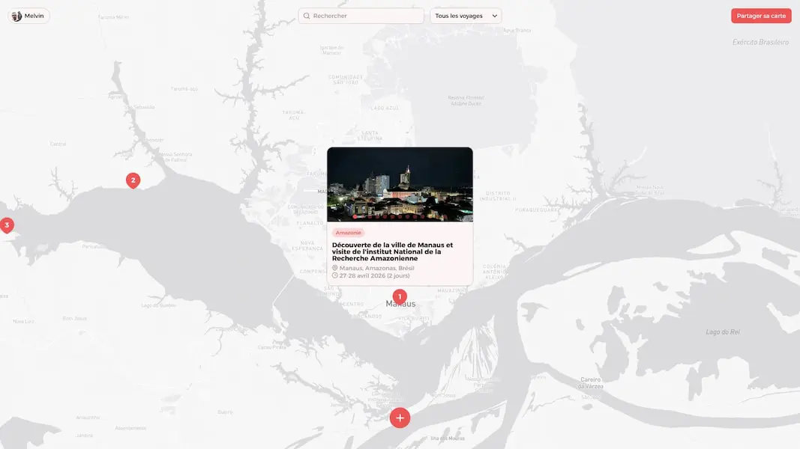

# Globe Trotter

https://globe-trotter.tech/

## Description

Globe Trotter is a website where you can map your travels interactively and share them with others

## Tech stack

### Backend
- [AdonisJS](https://adonisjs.com/) — Node.js (>= 24) web framework
- [TypeScript](https://www.typescriptlang.org/)
- [Lucid ORM](https://lucid.adonisjs.com/) with [PostgreSQL](https://www.postgresql.org/) (`pg`)
- [VineJS](https://vinejs.dev/) for validation
- [Edge.js](https://edgejs.dev/) templating
- [Sharp](https://sharp.pixelplumbing.com/) and `heic-convert` / `heic-to` for image processing
- AdonisJS Auth, Mail, Session, Shield, CORS, and Drive (file storage)

### Frontend
- [Vue 3](https://vuejs.org/)
- [Inertia.js](https://inertiajs.com/) for SPA-style routing without a separate API
- [Vite](https://vite.dev/) for bundling and HMR
- [Sass](https://sass-lang.com/) for styling
- [Mapbox GL JS](https://docs.mapbox.com/mapbox-gl-js/) for interactive maps
- [Vue Datepicker](https://vue3datepicker.com/)

### Tooling
- ESLint and Prettier
- [Docker](https://www.docker.com/) for local services and production deployment

## Why I built this

The idea came to me during the final days of my trip to the Amazon. I overheard my travel companions talking about how they planned to add this journey to their corkboards when they got home. Hearing that, I thought to myself: "Why don’t I develop this idea?"

Before leaving, I had been searching for a project that truly suited me and that I could use myself. This turned out to be the perfect one.

So, I built it to turn travel memories into something tangible and shareable.
